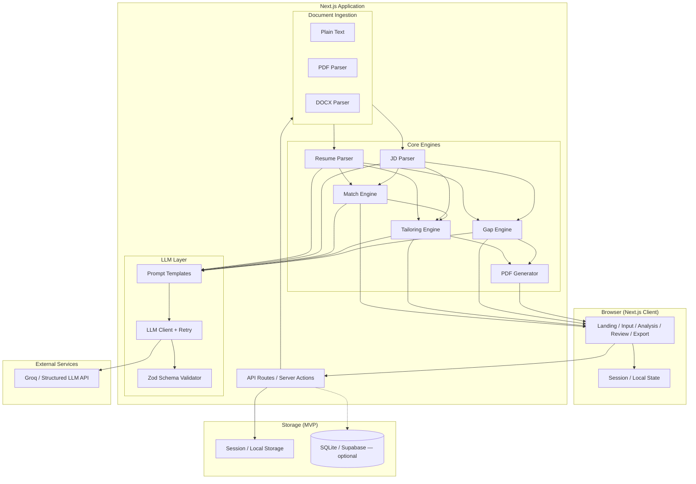
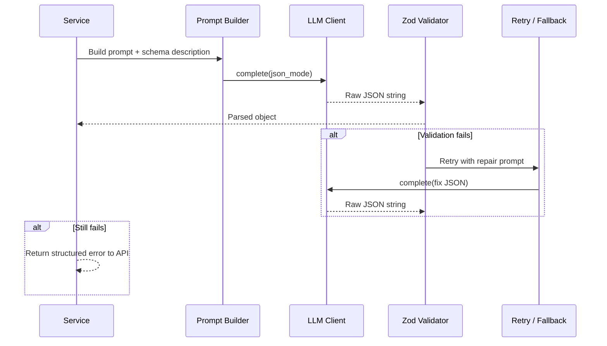
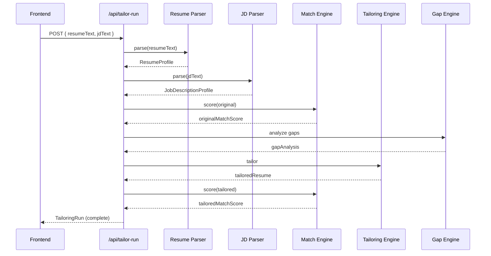
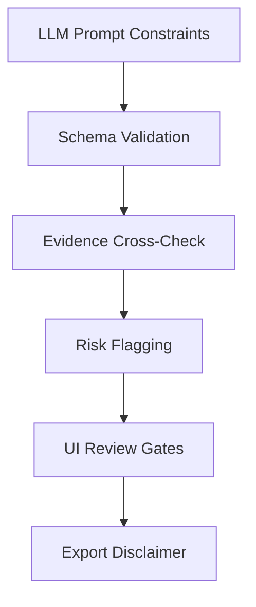
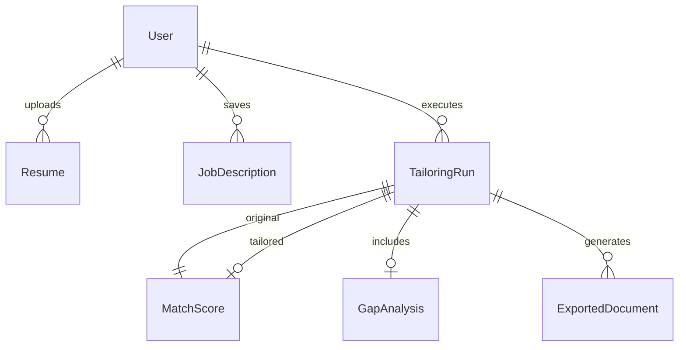

# Resume Shapeshifter — System Architecture

This document defines the technical architecture for **Resume Shapeshifter**, a JD-to-resume tailoring engine. It translates the product requirements in `problemstatement.md` into implementable system design: components, data contracts, flows, guardrails, and deployment considerations.

---

## Table of Contents

1. [Architecture Overview](#1-architecture-overview)
2. [Design Principles](#2-design-principles)
3. [High-Level System Diagram](#3-high-level-system-diagram)
4. [Technology Stack](#4-technology-stack)
5. [Repository Structure](#5-repository-structure)
6. [Domain Models and Schemas](#6-domain-models-and-schemas)
7. [Core Services](#7-core-services)
8. [LLM Integration Layer](#8-llm-integration-layer)
9. [API Design](#9-api-design)
10. [Frontend Architecture](#10-frontend-architecture)
11. [End-to-End Workflows](#11-end-to-end-workflows)
12. [PDF Generation Architecture](#12-pdf-generation-architecture)
13. [Truthfulness and Guardrails](#13-truthfulness-and-guardrails)
14. [Data Storage Strategy](#14-data-storage-strategy)
15. [Error Handling and Resilience](#15-error-handling-and-resilience)
16. [Security and Privacy](#16-security-and-privacy)
17. [Observability](#17-observability)
18. [Testing Strategy](#18-testing-strategy)
19. [Implementation Phases](#19-implementation-phases)
20. [Risks and Mitigations](#20-risks-and-mitigations)
21. [Definition of Done (Architecture)](#21-definition-of-done-architecture)

---

## 1. Architecture Overview

Resume Shapeshifter is a **pipeline-oriented web application** that ingests unstructured resume and job-description inputs, normalizes them into structured profiles, evaluates alignment, rewrites content under strict truthfulness constraints, and produces reviewable artifacts including a side-by-side comparison PDF.

### System Boundaries

| In scope (MVP) | Out of scope (MVP) |
|---|---|
| Resume paste / PDF / DOCX input | Automated job applications |
| JD paste input | Large-scale job board scraping |
| Structured parsing, scoring, tailoring, gap analysis | Fabricated work history or credentials |
| Side-by-side UI and PDF export | Guaranteed ATS ranking |
| Session-based state | Complex multi-column resume fidelity |

### Architectural Style

- **Monolithic full-stack app** for MVP (Next.js App Router with API routes), optimized for a vertical slice and portfolio demo.
- **Service-oriented modules** inside the monolith: each engine (parse, score, tailor, gap, PDF) is a discrete module with typed inputs/outputs.
- **LLM as structured extraction and rewrite engine**, not as source of truth — all outputs validated against Zod schemas and cross-checked against original resume evidence.
- **Stateless API handlers** with client-side or session storage for MVP; optional persistence layer added later without changing engine contracts.

---

## 2. Design Principles

1. **Truthfulness first** — No component may emit content that cannot be traced to resume evidence. Gaps are flagged, not invented.
2. **Structured I/O everywhere** — LLM responses must conform to JSON schemas validated by Zod before downstream use.
3. **Explainability by default** — Scores, rewrites, and gaps include human-readable rationale and evidence strings.
4. **Vertical slice over breadth** — Ship paste-text input → analyze → tailor → side-by-side → PDF before file upload polish.
5. **Separation of concerns** — UI components render; `/lib` and `/services` own business logic; `/prompts` own LLM instructions.
6. **Idempotent tailoring runs** — A `TailoringRun` is a reproducible artifact keyed by resume + JD content hashes (optional in MVP).
7. **Fail visibly** — Parsing and LLM failures surface actionable errors; never silently return partial or hallucinated data.

---

## 3. High-Level System Diagram



---

## 4. Technology Stack

| Layer | Choice | Rationale |
|---|---|---|
| **Frontend** | Next.js 14+, React, TypeScript | Full-stack in one repo; SSR for landing; client components for interactive editor |
| **Styling** | Tailwind CSS, shadcn/ui | Rapid, consistent UI for forms, cards, diff views |
| **Backend** | Next.js API Routes (App Router) | Co-located with frontend; sufficient for MVP |
| **Validation** | Zod | Runtime validation of LLM JSON and API payloads |
| **LLM** | Groq API (structured outputs / JSON mode) | Reliable schema-constrained generation |
| **Document parsing** | `pdf-parse` (PDF), `mammoth` (DOCX) | Common Node ecosystem; fallback to LLM cleanup pass |
| **PDF export** | `@react-pdf/renderer` or Playwright print-to-PDF | React PDF for programmatic layout; Playwright for pixel-perfect HTML comparison |
| **Storage (MVP)** | React state + `sessionStorage` | No auth required for demo |
| **Storage (optional)** | SQLite via Drizzle ORM or Supabase | Persist runs, resumes, exports |
| **Testing** | Vitest + Playwright | Unit tests for schemas/scoring; E2E for full flow |

### Alternative Backend (Phase 2+)

If PDF/DOCX parsing quality is insufficient in Node, introduce a **Python FastAPI microservice** for document ingestion only. The Next.js app remains the orchestrator; FastAPI exposes `/parse/resume` and `/parse/jd` returning the same JSON schemas.

---

## 5. Repository Structure

```text
resume-builder-project/
├── app/
│   ├── page.tsx                    # Landing
│   ├── input/page.tsx              # Resume + JD input
│   ├── analyze/page.tsx            # JD summary, scores, initial gaps
│   ├── review/page.tsx             # Side-by-side bullet diff
│   ├── export/page.tsx             # Download tailored + comparison PDFs
│   └── api/
│       ├── parse/resume/route.ts
│       ├── parse/jd/route.ts
│       ├── match/route.ts
│       ├── tailor/route.ts
│       ├── gaps/route.ts
│       ├── tailor-run/route.ts     # Orchestrated full pipeline
│       └── export/pdf/route.ts
├── components/
│   ├── ResumeInput.tsx
│   ├── JDInput.tsx
│   ├── ScoreCard.tsx
│   ├── GapAnalysis.tsx
│   ├── SideBySideDiff.tsx
│   ├── BulletChangeCard.tsx
│   ├── JDSummaryPanel.tsx
│   └── PDFExportButton.tsx
├── lib/
│   ├── schemas.ts                  # Zod schemas (source of truth for types)
│   ├── types.ts                    # Inferred TypeScript types
│   ├── scoring.ts                  # Deterministic score helpers
│   ├── hash.ts                     # Content hashing for run IDs
│   └── constants.ts
├── services/
│   ├── resume-parser.ts
│   ├── jd-parser.ts
│   ├── match-engine.ts
│   ├── tailoring-engine.ts
│   ├── gap-engine.ts
│   ├── pdf-generator.ts
│   └── document-ingestion.ts       # PDF/DOCX/text normalization
├── prompts/
│   ├── jd-extraction.ts
│   ├── resume-parser.ts
│   ├── match-scoring.ts
│   ├── bullet-rewriter.ts
│   ├── gap-analysis.ts
│   └── resume-assembly.ts
├── llm/
│   ├── client.ts                   # Groq wrapper, retries, timeouts
│   └── structured-output.ts        # JSON mode + schema enforcement
├── templates/
│   └── comparison-pdf.tsx          # React PDF layout
├── fixtures/
│   ├── sample-resume.txt
│   └── sample-jd.txt
├── public/
├── architecture.md
├── problemstatement.md
└── package.json
```

---

## 6. Domain Models and Schemas

All domain objects are defined once in `lib/schemas.ts` and exported as TypeScript types via `z.infer`. This prevents drift between API, LLM output, and UI.

### 6.1 ResumeProfile

Parsed representation of the user's resume.

```typescript
// Conceptual schema — implement with Zod
ResumeProfile {
  contact: {
    name?: string
    email?: string
    phone?: string
    location?: string
    links?: string[]
  }
  summary?: string
  skills: string[]
  experience: ExperienceEntry[]
  projects: ProjectEntry[]
  education: EducationEntry[]
  certifications: CertificationEntry[]
  rawText?: string              // preserved for evidence lookup
}

ExperienceEntry {
  company: string
  title: string
  startDate?: string
  endDate?: string
  location?: string
  bullets: string[]
}

ProjectEntry {
  name: string
  description?: string
  bullets: string[]
  technologies?: string[]
}

EducationEntry {
  institution: string
  degree?: string
  field?: string
  graduationDate?: string
}

CertificationEntry {
  name: string
  issuer?: string
  date?: string
}
```

### 6.2 JobDescriptionProfile

Structured JD extracted from pasted text.

```typescript
JobDescriptionProfile {
  jobTitle: string
  company?: string
  requiredSkills: string[]
  preferredSkills: string[]
  responsibilities: string[]
  qualifications: string[]
  tools: string[]
  keywords: string[]
  seniorityLevel: 'intern' | 'entry' | 'mid' | 'senior' | 'staff' | 'unknown'
  domainSignals: string[]
  softSkills: string[]
  rawText?: string
}
```

### 6.3 MatchScore

Explainable alignment score before/after tailoring.

```typescript
MatchScore {
  overallScore: number              // 0–100
  skillCoverageScore: number
  preferredSkillCoverageScore?: number
  responsibilityAlignmentScore: number
  keywordScore: number
  seniorityScore: number
  criticalMissingRequirements: string[]
  explanation: string
  breakdown?: ScoreBreakdownItem[]  // optional per-dimension detail
}

ScoreBreakdownItem {
  dimension: string
  score: number
  evidence: string
}
```

### 6.4 TailoredResume

Output of the tailoring engine with per-bullet metadata.

```typescript
TailoredResume {
  tailoredSummary?: string
  tailoredSkills: string[]          // reordered / grouped, not invented
  tailoredExperience: TailoredExperienceEntry[]
  tailoredProjects?: TailoredProjectEntry[]
}

TailoredExperienceEntry {
  company: string
  title: string
  startDate?: string
  endDate?: string
  bullets: BulletRewrite[]
}

BulletRewrite {
  original: string
  tailored: string
  changeReason: string
  keywordsAddressed: string[]
  confidence: 'high' | 'medium' | 'low'
  riskFlag?: string                 // e.g. "May overstate scope"
  userConfirmed?: boolean           // set during review
}
```

### 6.5 GapAnalysis

Actionable missing or weak requirements.

```typescript
GapAnalysis {
  gaps: ResumeGap[]
}

ResumeGap {
  name: string
  importance: 'high' | 'medium' | 'low'
  jdEvidence: string
  resumeEvidence: string            // empty if absent
  suggestedAction: string
  canSafelyAdd: boolean             // false → never auto-insert
  category: 'skill' | 'tool' | 'domain' | 'seniority' | 'qualification'
}
```

### 6.6 TailoringRun (Aggregate Root)

Single orchestrated execution tying all artifacts together.

```typescript
TailoringRun {
  id: string
  createdAt: string
  resumeHash: string
  jdHash: string
  resume: ResumeProfile
  jobDescription: JobDescriptionProfile
  originalMatchScore: MatchScore
  tailoredMatchScore?: MatchScore
  tailoredResume?: TailoredResume
  gapAnalysis?: GapAnalysis
  status: 'pending' | 'parsed' | 'scored' | 'tailored' | 'complete' | 'failed'
  error?: string
}
```

---

## 7. Core Services

Each service is a pure async function (or class with injected LLM client) accepting validated input and returning validated output.

### 7.1 Document Ingestion Service

**Responsibility:** Normalize raw user input into plain text suitable for parsing.

| Input | Processing |
|---|---|
| Plain text | Trim, normalize line breaks |
| PDF | `pdf-parse` → text; flag low-confidence if garbled |
| DOCX | `mammoth` → HTML/text → strip markup |

**Output:** `{ rawText: string, sourceFormat: 'text' | 'pdf' | 'docx', warnings: string[] }`

Post-ingestion, optionally run an LLM **cleanup pass** (`prompts/resume-parser.ts`) to fix section boundaries when heuristic parsing fails.

### 7.2 Resume Parser Service

**Responsibility:** Convert resume text → `ResumeProfile`.

**Strategy (hybrid):**

1. **Heuristic pass** — Detect section headers (Experience, Education, Skills, etc.) via regex and line clustering.
2. **LLM structured extraction** — Send raw text + heuristic hints to LLM; validate with `ResumeProfileSchema`.
3. **Evidence preservation** — Store `rawText` on profile for downstream truthfulness checks.

### 7.3 JD Parser Service

**Responsibility:** Convert JD text → `JobDescriptionProfile`.

Single LLM call with `prompts/jd-extraction.ts`. Post-process:

- Deduplicate skills/keywords (case-insensitive).
- Classify seniority via keyword rules as fallback if LLM returns `unknown`.

### 7.4 Match Engine

**Responsibility:** Compute `MatchScore` for a `(ResumeProfile, JobDescriptionProfile)` pair.

**Hybrid scoring model:**

| Component | Weight (suggested) | Method |
|---|---|---|
| Required skill coverage | 35% | Fuzzy match resume skills + bullet text vs required skills |
| Preferred skill coverage | 10% | Same as above for preferred |
| Responsibility alignment | 25% | Embedding or LLM-assisted semantic match |
| Keyword alignment | 15% | JD keywords found in resume |
| Seniority alignment | 10% | Title/years heuristic vs JD seniority |
| Critical missing penalty | −5 to −20 | Subtract for high-importance gaps |

**Implementation:**

- **Deterministic layer** (`lib/scoring.ts`) — skill/keyword overlap, fast and testable.
- **LLM layer** (`prompts/match-scoring.ts`) — responsibility alignment + narrative `explanation`.

Final score = weighted blend, clamped 0–100. Always attach `explanation` and `criticalMissingRequirements`.

### 7.5 Tailoring Engine

**Responsibility:** Produce `TailoredResume` without fabricating facts.

**Pipeline:**

1. Identify **rewrite candidates** — experience/project bullets with partial JD overlap.
2. For each bullet, call LLM with:
   - Original bullet
   - Parent job context (company, title)
   - Relevant JD requirements subset
   - Explicit constraint: "Do not add tools, metrics, or scope not implied by original"
3. Validate each `BulletRewrite` with schema.
4. Run **risk detector** (rule-based + LLM flag) on low-confidence rewrites.
5. Optionally reorder skills section (JD-relevant first) without adding new skills.
6. Optionally rewrite summary if present and supported by experience bullets.

**Batching:** Process bullets in batches of 5–8 to reduce latency and cost.

### 7.6 Gap Engine

**Responsibility:** Produce `GapAnalysis` comparing JD requirements to resume evidence.

**Logic:**

1. LLM extracts candidate gaps with JD evidence quotes.
2. Deterministic verification — search resume text for each gap name/synonym.
3. Assign `importance` from JD language ("required", "must have" → high).
4. Set `canSafelyAdd: false` for all gaps; tailoring never auto-fills gaps.

### 7.7 PDF Generator Service

**Responsibility:** Render two PDFs:

1. **Tailored Resume PDF** — Clean single-column resume from `TailoredResume`.
2. **Comparison PDF (proof artifact)** — Side-by-side layout with scores, JD summary, highlighted diffs, gap table, disclaimer.

See [Section 12](#12-pdf-generation-architecture).

---

## 8. LLM Integration Layer

### 8.1 Client Configuration

```typescript
// llm/client.ts responsibilities
- API key from env (GROQ_API_KEY)
- Model: llama-3.3-70b-versatile or llama-3.1-8b-instant (mini for extraction, full for rewriting)
- Timeout: 60s per call
- Retries: 2 with exponential backoff on 429/5xx
- Token limits: truncate JD/resume to model context with section-aware chunking
```

### 8.2 Prompt Inventory

| Prompt file | Purpose | Output schema |
|---|---|---|
| `jd-extraction.ts` | Parse JD | `JobDescriptionProfile` |
| `resume-parser.ts` | Structure resume | `ResumeProfile` |
| `match-scoring.ts` | Score + explain | `MatchScore` |
| `bullet-rewriter.ts` | Rewrite one bullet | `BulletRewrite` |
| `gap-analysis.ts` | Find gaps | `GapAnalysis` |
| `resume-assembly.ts` | Final coherence pass | `TailoredResume` (optional) |

### 8.3 Universal Prompt Rules (embedded in every prompt)

- Never invent employers, degrees, certifications, tools, or metrics.
- Use only evidence from the provided resume text.
- Mark uncertain suggestions; prefer `confidence: low` when stretching terminology.
- Output **valid JSON only** matching the provided schema.
- Keep bullets ≤ 2 lines, resume-appropriate tone.
- Avoid keyword stuffing; max 1–2 JD terms added per bullet when truthful.

### 8.4 Structured Output Flow



---

## 9. API Design

All routes accept/return JSON. Errors use `{ error: string, code: string, details?: unknown }`.

### 9.1 Endpoints

| Method | Route | Description |
|---|---|---|
| `POST` | `/api/parse/resume` | Body: `{ text }` or `{ fileBase64, format }` → `ResumeProfile` |
| `POST` | `/api/parse/jd` | Body: `{ text }` → `JobDescriptionProfile` |
| `POST` | `/api/match` | Body: `{ resume, jobDescription }` → `MatchScore` |
| `POST` | `/api/tailor` | Body: `{ resume, jobDescription, originalScore? }` → `TailoredResume` |
| `POST` | `/api/gaps` | Body: `{ resume, jobDescription }` → `GapAnalysis` |
| `POST` | `/api/tailor-run` | Full pipeline → `TailoringRun` |
| `POST` | `/api/export/pdf` | Body: `{ tailoringRun, type: 'tailored' \| 'comparison' }` → PDF binary |

### 9.2 Orchestrated Pipeline: `/api/tailor-run`

Preferred entry point for the UI "Analyze" button.



**Streaming (optional enhancement):** Server-Sent Events for progressive UI updates (`parsed`, `scored`, `tailored`, `complete`).

### 9.3 Request Size Limits

- Max resume/JD text: 32 KB each (adjust per model context).
- Max file upload: 5 MB PDF/DOCX.
- Reject empty or < 100 character inputs with `400 INVALID_INPUT`.

---

## 10. Frontend Architecture

### 10.1 Page Map

| Route | Purpose | Key components |
|---|---|---|
| `/` | Landing, value prop, CTA | Hero, feature list, sample demo link |
| `/input` | Resume + JD capture | `ResumeInput`, `JDInput`, format tabs |
| `/analyze` | Post-parse dashboard | `JDSummaryPanel`, `ScoreCard`, `GapAnalysis` |
| `/review` | Side-by-side diff | `SideBySideDiff`, `BulletChangeCard` |
| `/export` | Downloads | `PDFExportButton`, disclaimer |

### 10.2 Client State Model

Use React Context or Zustand store:

```typescript
AppState {
  resumeText: string
  jdText: string
  resumeProfile?: ResumeProfile
  jobDescription?: JobDescriptionProfile
  tailoringRun?: TailoringRun
  ui: {
    step: 'input' | 'analyze' | 'review' | 'export'
    isLoading: boolean
    error?: string
  }
}
```

Persist to `sessionStorage` on each successful pipeline step so refresh does not lose work.

### 10.3 UI Interaction Patterns

- **Analyze** triggers `/api/tailor-run` with loading skeleton on score/gap sections.
- **Review** shows original vs tailored bullets in two columns; changed bullets get highlight + expand for `changeReason`, `confidence`, `riskFlag`.
- **Confirm toggle** on low-confidence bullets before export (sets `userConfirmed`).
- **Export** requires explicit checkbox: "I have reviewed and verified all content."

### 10.4 Component Data Flow

```mermaid
flowchart LR
    Input[ResumeInput / JDInput] --> Store[App State]
    Store --> AnalyzeBtn[Analyze Button]
    AnalyzeBtn --> API[/api/tailor-run]
    API --> Store
    Store --> ScoreCard
    Store --> GapAnalysis
    Store --> SideBySideDiff
    SideBySideDiff --> Export[PDFExportButton]
```

---

## 11. End-to-End Workflows

### 11.1 Primary User Journey

1. User pastes resume and JD on `/input`.
2. User clicks **Analyze** → orchestrated pipeline runs.
3. `/analyze` displays JD summary, original score, gaps.
4. User navigates to `/review` for bullet-level diffs.
5. User confirms low-risk flags, clicks **Export** on `/export`.
6. Browser downloads tailored PDF + comparison PDF.

### 11.2 Score Comparison Workflow

Always compute and display **both** scores:

- `originalMatchScore` — resume as parsed, before tailoring.
- `tailoredMatchScore` — resume rebuilt from accepted `BulletRewrite.tailored` strings.

The comparison PDF header shows: `Original: 62 → Tailored: 78` with short explanation delta.

### 11.3 Re-run Tailoring (optional)

If user edits resume text on `/review`, invalidate `tailoringRun` and re-trigger tailor step only (reuse parsed JD).

---

## 12. PDF Generation Architecture

### 12.1 Tailored Resume PDF

- **Engine:** `@react-pdf/renderer` template `templates/tailored-resume-pdf.tsx`.
- **Layout:** Single column, 10–11pt font, standard sections (Contact, Summary, Skills, Experience, Education).
- **Content source:** `TailoredResume` — use `tailored` bullet text only.

### 12.2 Side-by-Side Comparison PDF (Proof Artifact)

- **Engine:** `@react-pdf/renderer` or HTML template + Playwright `page.pdf()`.
- **Recommended layout:**

```text
┌─────────────────────────────────────────────────────────────┐
│  Resume Shapeshifter — Tailoring Report                     │
│  Role: {jobTitle} @ {company}                               │
│  Match Score: {original} → {tailored}                       │
├──────────────────────────┬──────────────────────────────────┤
│  ORIGINAL                │  TAILORED                        │
│  (highlight unchanged)   │  (highlight changed bullets)     │
├──────────────────────────┴──────────────────────────────────┤
│  JD Requirements Summary (top skills, responsibilities)     │
├─────────────────────────────────────────────────────────────┤
│  Gap Analysis Table                                         │
│  Gap | Importance | Suggested Action                        │
├─────────────────────────────────────────────────────────────┤
│  DISCLAIMER: User must verify all content before use.       │
└─────────────────────────────────────────────────────────────┘
```

### 12.3 Change Highlighting

Maintain a `Set<string>` of changed bullet indices. In PDF:

- Original column: yellow background on bullets that changed.
- Tailored column: green background on new wording.
- Footer per changed bullet: `Reason: {changeReason}` in small type (or appendix page).

### 12.4 API Response

`POST /api/export/pdf` returns:

- `Content-Type: application/pdf`
- `Content-Disposition: attachment; filename="resume-shapeshifter-comparison-{jobTitle}.pdf"`

---

## 13. Truthfulness and Guardrails

Truthfulness is a **cross-cutting architectural concern**, not a single prompt line.

### 13.1 Guardrail Layers



| Layer | Implementation |
|---|---|
| **Prompt constraints** | Never invent facts; cite original bullet in rewrite reasoning |
| **Schema validation** | Zod rejects malformed or extra fields |
| **Evidence cross-check** | For each new tool/skill in tailored bullet, verify substring or synonym exists in original bullet + resume skills |
| **Risk flagging** | Regex + rules: new numbers, "led team of N", "expert", new proper nouns → `riskFlag` |
| **UI review gates** | Low confidence + risk flagged bullets require toggle before export |
| **Export disclaimer** | Fixed legal copy in comparison PDF and export page |

### 13.2 Unsupported Claim Detection (Deterministic)

```typescript
// lib/truthfulness.ts
detectUnsupportedClaims(original: string, tailored: string, resume: ResumeProfile): string[] {
  // Flag if tailored introduces:
  // - Numeric metrics not in original
  // - Technology tokens not in resume.skills or original bullet
  // - Seniority upgrades ("junior" → "senior architect")
}
```

### 13.3 Gap vs Tailoring Boundary

- **Tailoring engine** may rephrase existing content.
- **Gap engine** may suggest additions but `canSafelyAdd` is always `false` for MVP auto-insert.
- Skills section reordering allowed; **adding skills** only if already present elsewhere in resume text (skills section or bullets).

---

## 14. Data Storage Strategy

### 14.1 MVP: Session-Only

- No database required for demo/portfolio.
- Store `TailoringRun` JSON in `sessionStorage` (max ~5 MB).
- PDFs generated on demand, not stored server-side.

### 14.2 Optional Persistence (Post-MVP)



**Tables:** `users`, `resumes`, `job_descriptions`, `tailoring_runs`, `exported_documents`

Use content hashes (`resumeHash`, `jdHash`) to deduplicate and cache LLM results.

---

## 15. Error Handling and Resilience

| Failure | User-facing behavior | System behavior |
|---|---|---|
| PDF parse garbled | Warning banner + suggest paste text | Return partial text + `warnings[]` |
| LLM timeout | "Analysis timed out, retry" | Retry 2x, then fail gracefully |
| Invalid JSON from LLM | Generic error + retry button | Repair prompt retry, log raw response |
| Empty JD/resume | Inline validation | `400 INVALID_INPUT` |
| Rate limit | "Service busy" | Backoff + queue (future) |

**Partial success:** If tailoring fails but parsing/scoring succeed, return `TailoringRun` with `status: 'failed'` and preserved `originalMatchScore` + `gapAnalysis`.

---

## 16. Security and Privacy

- **API keys** server-side only (`GROQ_API_KEY` in `.env.local`, never exposed to client).
- **No persistent PII storage** in MVP unless user opts in.
- **File upload sanitization** — validate MIME type, size limits; do not execute uploaded content.
- **Rate limiting** — basic IP-based limit on `/api/tailor-run` (e.g., 10/hour) for public deployment.
- **CORS** — restrict to app origin in production.
- **Disclaimer** — user responsible for final resume accuracy.

---

## 17. Observability

MVP logging (structured JSON to stdout):

```typescript
log.info('tailor_run_complete', {
  runId,
  durationMs,
  originalScore,
  tailoredScore,
  bulletCount,
  gapCount,
  llmCalls,
})
```

Do **not** log full resume/JD text in production; log hashes only.

Future: OpenTelemetry traces per pipeline stage, LLM token usage metrics.

---

## 18. Testing Strategy

| Layer | Focus | Tools |
|---|---|---|
| **Unit** | Zod schemas, scoring weights, truthfulness rules | Vitest |
| **Integration** | Mock LLM returns fixed JSON; full pipeline | Vitest + MSW |
| **Snapshot** | PDF template renders without crash | React PDF render test |
| **E2E** | Paste sample → analyze → export PDF | Playwright |
| **Fixture-based** | Real JD + resume in `/fixtures` | Manual + automated |

### Critical Test Cases

1. Tailored bullet never introduces a technology absent from original resume.
2. Match score decreases when required skill is removed from resume text.
3. Gap with no resume evidence has empty `resumeEvidence`.
4. Comparison PDF includes disclaimer and both scores.
5. Invalid LLM JSON triggers retry then error (no silent pass-through).

---

## 19. Implementation Phases

Aligned with `problemstatement.md` Section 15.

### Phase 1: Static Prototype
- UI shell: input, mock scores, static side-by-side
- Zod schemas defined
- No LLM

### Phase 2: LLM Integration
- Wire all prompts + `/api/tailor-run`
- Real parsing, scoring, tailoring, gaps
- Session state persistence

### Phase 3: PDF Export
- Tailored + comparison PDF templates
- Highlight logic

### Phase 4: Validation and Guardrails
- `detectUnsupportedClaims`
- Confidence labels, user confirmation toggles
- Strict schema repair loop

### Phase 5: Polish
- PDF/DOCX upload
- Sample data, loading states, error UX
- Deploy to Vercel

---

## 20. Risks and Mitigations

| Risk | Impact | Mitigation |
|---|---|---|
| Multi-column PDF parse errors | Broken resume structure | Warn user; offer paste-text fallback; LLM cleanup pass |
| LLM overstatement | Trust / ethical harm | Truthfulness layers (Section 13); risk flags; user review |
| Opaque scoring | User distrust | Always show `explanation` + breakdown |
| JSON inconsistency | Pipeline failures | Zod + repair retry; deterministic fallbacks for scores |
| Cost/latency | Poor UX | Batch bullets; use mini model for extraction; cache by hash |
| Over-trust by users | Misrepresentation in applications | Export disclaimer + confirmation checkbox |

---

## 21. Definition of Done (Architecture)

The architecture is successfully realized when the deployed system can:

1. Accept pasted resume + JD (and optionally PDF/DOCX).
2. Execute the full `TailoringRun` pipeline with validated JSON at every stage.
3. Display original and tailored match scores with explanations.
4. Present side-by-side bullet diffs with rewrite metadata.
5. Show actionable gap analysis without auto-fabricating content.
6. Export a **comparison PDF** containing original vs tailored content, scores, JD summary, gaps, and disclaimer.
7. Enforce truthfulness guardrails through prompts, validation, evidence checks, and UI review gates.

The proof artifact — the side-by-side comparison PDF — is the primary deliverable demonstrating that Resume Shapeshifter improves alignment **without** inventing experience.

---

## Appendix A: Environment Variables

```bash
# Required
GROQ_API_KEY=

# Optional
GROQ_MODEL=llama-3.3-70b-versatile
GROQ_MODEL_MINI=llama-3.1-8b-instant
MAX_RESUME_CHARS=32000
MAX_JD_CHARS=16000
RATE_LIMIT_PER_HOUR=10
```

## Appendix B: Key Type Exports

```typescript
export type ResumeProfile = z.infer<typeof ResumeProfileSchema>
export type JobDescriptionProfile = z.infer<typeof JobDescriptionProfileSchema>
export type MatchScore = z.infer<typeof MatchScoreSchema>
export type TailoredResume = z.infer<typeof TailoredResumeSchema>
export type GapAnalysis = z.infer<typeof GapAnalysisSchema>
export type TailoringRun = z.infer<typeof TailoringRunSchema>
```

## Appendix C: Sample API Response (TailoringRun)

```json
{
  "id": "run_abc123",
  "status": "complete",
  "originalMatchScore": {
    "overallScore": 58,
    "skillCoverageScore": 45,
    "responsibilityAlignmentScore": 62,
    "keywordScore": 55,
    "seniorityScore": 70,
    "criticalMissingRequirements": ["Kubernetes", "Team leadership"],
    "explanation": "Strong backend overlap but missing required cloud orchestration and leadership signals."
  },
  "tailoredMatchScore": {
    "overallScore": 74,
    "skillCoverageScore": 60,
    "responsibilityAlignmentScore": 78,
    "keywordScore": 72,
    "seniorityScore": 72,
    "criticalMissingRequirements": ["Kubernetes"],
    "explanation": "Rewrites surface existing Docker and mentoring experience using JD terminology."
  },
  "gapAnalysis": {
    "gaps": [
      {
        "name": "Kubernetes",
        "importance": "high",
        "jdEvidence": "Required: experience with Kubernetes in production",
        "resumeEvidence": "",
        "suggestedAction": "Add only if you have used Kubernetes; otherwise prepare to address in interview",
        "canSafelyAdd": false,
        "category": "tool"
      }
    ]
  }
}
```

---

*Document version: 1.0 — derived from `problemstatement.md`*
