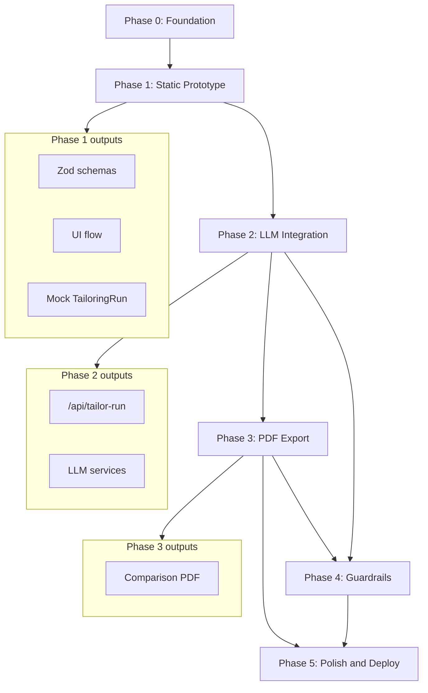

# Resume Shapeshifter — Phase-Wise Implementation Plan

This document is the executable build plan for Resume Shapeshifter. It expands [architecture.md](./architecture.md) Section 19 into concrete tasks, deliverables, acceptance criteria, and verification steps for each phase.

---

## Table of Contents

1. [Plan Overview](#1-plan-overview)
2. [Phase 0: Project Foundation](#phase-0-project-foundation)
3. [Phase 1: Static Prototype](#phase-1-static-prototype)
4. [Phase 2: LLM Integration](#phase-2-llm-integration)
5. [Phase 3: PDF Export](#phase-3-pdf-export)
6. [Phase 4: Validation and Guardrails](#phase-4-validation-and-guardrails)
7. [Phase 5: Polish and Deploy](#phase-5-polish-and-deploy)
8. [Cross-Phase Dependency Map](#cross-phase-dependency-map)
9. [MVP Definition of Done Checklist](#mvp-definition-of-done-checklist)

---

## 1. Plan Overview

### Guiding Rules

1. **Vertical slice first** — Paste text → analyze → review → export before file upload or persistence.
2. **Schemas before services** — Define Zod contracts in Phase 1; all later phases validate against them.
3. **One orchestrator** — `/api/tailor-run` is the primary pipeline entry point once Phase 2 begins.
4. **No fabrication** — Guardrails are introduced in Phase 4 but truthfulness prompt rules start in Phase 2.
5. **Demo-ready artifact** — The side-by-side comparison PDF (Phase 3) is the portfolio proof; everything else supports it.

### Phase Summary

| Phase | Name | Primary Outcome | Est. Effort |
|---|---|---|---|
| **0** | Project Foundation | Runnable Next.js app, tooling, folder skeleton | 0.5–1 day |
| **1** | Static Prototype | Full UI flow with mock data, no LLM | 2–3 days |
| **2** | LLM Integration | Real parsing, scoring, tailoring, gaps via API | 4–6 days |
| **3** | PDF Export | Tailored + comparison PDF downloads | 2–3 days |
| **4** | Validation and Guardrails | Truthfulness checks, review gates, schema repair | 2–3 days |
| **5** | Polish and Deploy | Uploads, samples, UX, Vercel deployment | 2–3 days |

**Total MVP estimate:** ~13–19 days for a solo developer.

### Recommended Build Order (Critical Path)

```text
Phase 0 → Phase 1 (schemas + UI) → Phase 2 (LLM pipeline) → Phase 3 (PDF) → Phase 4 (guardrails) → Phase 5 (polish)
```

Phases 4 and 5 can partially overlap (e.g., loading states in Phase 5 while guardrails are finalized).

---

## Phase 0: Project Foundation

### Goal

Bootstrap the monorepo structure defined in architecture Section 5 so every later phase has a consistent home for code.

### Tasks

#### 0.1 Initialize the application

- [ ] Create Next.js 14+ app with App Router, TypeScript, Tailwind CSS, ESLint.
- [ ] Install core dependencies: `zod`, `zustand` (or React Context), `clsx`, `tailwind-merge`.
- [ ] Initialize shadcn/ui (`button`, `card`, `textarea`, `tabs`, `badge`, `skeleton`, `alert`, `checkbox`, `progress`).
- [ ] Add `.env.local.example` with variables from architecture Appendix A.
- [ ] Add `.gitignore` (include `.env.local`, `node_modules`, `.next`).

#### 0.2 Create folder skeleton

Create empty placeholder files (or minimal exports) for:

```text
app/page.tsx
app/input/page.tsx
app/analyze/page.tsx
app/review/page.tsx
app/export/page.tsx
components/          (empty index or stubs)
lib/schemas.ts
lib/types.ts
lib/constants.ts
services/              (empty stubs)
prompts/               (empty stubs)
llm/                   (empty stubs)
templates/
fixtures/sample-resume.txt
fixtures/sample-jd.txt
```

#### 0.3 Configure tooling

- [ ] Add path alias `@/` → project root in `tsconfig.json`.
- [ ] Configure Vitest for unit tests (`vitest.config.ts`).
- [ ] Add npm scripts: `dev`, `build`, `lint`, `test`, `test:e2e` (Playwright stub OK for now).
- [ ] Add a minimal README with setup instructions (install, env, dev server).

#### 0.4 Add sample fixtures

- [ ] Copy a realistic sample resume into `fixtures/sample-resume.txt`.
- [ ] Copy a real job listing (text only) into `fixtures/sample-jd.txt`.
- [ ] These fixtures will power demo mode and E2E tests in later phases.

### Deliverables

- `npm run dev` serves a placeholder landing page.
- Folder structure matches architecture Section 5.
- Sample fixtures committed.

### Acceptance Criteria

- [ ] App builds without TypeScript errors.
- [ ] Tailwind and shadcn components render on a test page.
- [ ] Environment variable names documented in `.env.local.example`.

### Phase 0 Exit Gate

> Developer can navigate to `/` and see a styled landing page with a link to `/input`.

---

## Phase 1: Static Prototype

### Goal

Build the complete user journey with **mock data** so UX, navigation, and component contracts are validated before LLM cost and complexity.

### Prerequisites

- Phase 0 complete.

### Tasks

#### 1.1 Define domain schemas (source of truth)

Implement full Zod schemas in `lib/schemas.ts`:

- [ ] `ContactSchema`, `ExperienceEntrySchema`, `ProjectEntrySchema`, `EducationEntrySchema`, `CertificationEntrySchema`
- [ ] `ResumeProfileSchema`
- [ ] `JobDescriptionProfileSchema`
- [ ] `MatchScoreSchema`, `ScoreBreakdownItemSchema`
- [ ] `BulletRewriteSchema`, `TailoredExperienceEntrySchema`, `TailoredResumeSchema`
- [ ] `ResumeGapSchema`, `GapAnalysisSchema`
- [ ] `TailoringRunSchema`

Export inferred types from `lib/types.ts`.

Add unit tests:

- [ ] Valid fixture objects pass schema parse.
- [ ] Invalid objects (missing required fields, out-of-range scores) fail with clear errors.

#### 1.2 Create mock data module

- [ ] `lib/mock-data.ts` — export a complete `TailoringRun` object built from fixtures + hardcoded scores, gaps, and bullet rewrites.
- [ ] Mock includes at least 3 rewritten bullets with varied `confidence` levels and one `riskFlag`.

#### 1.3 Build client state

- [ ] Implement Zustand store (or Context) per architecture Section 10.2:
  - `resumeText`, `jdText`
  - `tailoringRun` (loaded from mock after "Analyze")
  - `ui.step`, `ui.isLoading`, `ui.error`
- [ ] Persist `resumeText`, `jdText`, and `tailoringRun` to `sessionStorage` on change.

#### 1.4 Build UI pages and components

| Page | Components | Behavior |
|---|---|---|
| `/` | Hero, feature cards, CTA | Links to `/input`; optional "Try sample" loads fixtures |
| `/input` | `ResumeInput`, `JDInput` | Two textareas; validate min length client-side; **Analyze** sets loading → injects mock `TailoringRun` → navigates to `/analyze` |
| `/analyze` | `JDSummaryPanel`, `ScoreCard`, `GapAnalysis` | Show JD summary, original score only (tailored score hidden or shown as mock) |
| `/review` | `SideBySideDiff`, `BulletChangeCard` | Two-column bullet diff; expand for `changeReason`, `keywordsAddressed`, `confidence`, `riskFlag` |
| `/export` | `PDFExportButton` (disabled stub), disclaimer text | Checkbox: "I have reviewed..."; buttons disabled with "Coming in Phase 3" tooltip |

Component checklist:

- [ ] `ResumeInput.tsx` — character count, paste helper text
- [ ] `JDInput.tsx` — character count
- [ ] `ScoreCard.tsx` — overall score + sub-scores + explanation
- [ ] `JDSummaryPanel.tsx` — job title, company, skills, responsibilities
- [ ] `GapAnalysis.tsx` — table/cards with importance badges (high/medium/low)
- [ ] `SideBySideDiff.tsx` — original vs tailored columns, highlight changed bullets
- [ ] `BulletChangeCard.tsx` — expandable metadata per bullet
- [ ] `PDFExportButton.tsx` — stub only

#### 1.5 Add navigation and step indicator

- [ ] Shared layout with step progress: Input → Analyze → Review → Export.
- [ ] Guard routes: redirect to `/input` if no `tailoringRun` in state (except when loading mock via sample button).

#### 1.6 Deterministic scoring stub

- [ ] Implement `lib/scoring.ts` with skill/keyword overlap functions (no LLM).
- [ ] Wire mock `MatchScore` to use these functions against fixture data so scoring logic is testable early.

### Deliverables

- Clickable 4-step UI flow with mock analysis.
- All Zod schemas and types finalized.
- Unit tests for schemas and `lib/scoring.ts`.

### Acceptance Criteria

- [ ] User can paste resume + JD, click Analyze, and land on `/analyze` with mock results in &lt; 1s.
- [ ] `/review` shows side-by-side bullets with at least one highlighted change.
- [ ] `/analyze` shows gap list with importance and suggested actions.
- [ ] Refresh preserves state via `sessionStorage`.
- [ ] "Try sample" pre-fills fixtures and runs mock analyze.
- [ ] All schema unit tests pass.

### Phase 1 Exit Gate

> A stakeholder can walk through the full UX without an API key and understand the product flow.

---

## Phase 2: LLM Integration

### Goal

Replace mock data with a real server-side pipeline: parse → score → gap → tailor → re-score, orchestrated by `/api/tailor-run`.

### Prerequisites

- Phase 1 complete (schemas, UI, client state).
- Valid `GROQ_API_KEY` in `.env.local`.

### Tasks

#### 2.1 LLM client layer

Implement `llm/client.ts`:

- [ ] Groq SDK wrapper with configurable model (`GROQ_MODEL`, `GROQ_MODEL_MINI`).
- [ ] 60s timeout, 2 retries with exponential backoff on 429/5xx.
- [ ] Token-safe truncation helpers (section-aware, respect `MAX_RESUME_CHARS`, `MAX_JD_CHARS`).

Implement `llm/structured-output.ts`:

- [ ] JSON mode completion helper.
- [ ] Parse response → Zod validate → on failure, one repair retry with error context.
- [ ] Return typed result or throw structured error `{ code: 'LLM_VALIDATION_FAILED', details }`.

#### 2.2 Prompt templates

Create prompt files with system + user templates and embedded universal rules (architecture Section 8.3):

- [ ] `prompts/jd-extraction.ts` → `JobDescriptionProfile`
- [ ] `prompts/resume-parser.ts` → `ResumeProfile`
- [ ] `prompts/match-scoring.ts` → `MatchScore`
- [ ] `prompts/bullet-rewriter.ts` → `BulletRewrite`
- [ ] `prompts/gap-analysis.ts` → `GapAnalysis`
- [ ] `prompts/resume-assembly.ts` → optional final coherence pass

Each prompt must include:

- JSON schema description or example output.
- Truthfulness rules (no invented experience).
- Resume-appropriate bullet length guidance.

#### 2.3 Core services

| Service | File | Key behavior |
|---|---|---|
| Document ingestion | `services/document-ingestion.ts` | Plain text normalize only in Phase 2; PDF/DOCX deferred to Phase 5 |
| Resume parser | `services/resume-parser.ts` | Heuristic pre-pass + LLM extraction; preserve `rawText` |
| JD parser | `services/jd-parser.ts` | LLM extraction + dedupe skills/keywords + seniority fallback rules |
| Match engine | `services/match-engine.ts` | Blend `lib/scoring.ts` (deterministic) + LLM explanation |
| Tailoring engine | `services/tailoring-engine.ts` | Batch bullet rewrites (5–8 per call); reorder skills; optional summary rewrite |
| Gap engine | `services/gap-engine.ts` | LLM gap candidates + deterministic resume text verification |

Implement `lib/hash.ts`:

- [ ] `hashContent(text: string): string` for `resumeHash` / `jdHash` on `TailoringRun`.

#### 2.4 API routes

Implement routes per architecture Section 9.1:

- [ ] `POST /api/parse/resume` — `{ text }` → `ResumeProfile`
- [ ] `POST /api/parse/jd` — `{ text }` → `JobDescriptionProfile`
- [ ] `POST /api/match` — `{ resume, jobDescription }` → `MatchScore`
- [ ] `POST /api/tailor` — `{ resume, jobDescription }` → `TailoredResume`
- [ ] `POST /api/gaps` — `{ resume, jobDescription }` → `GapAnalysis`
- [ ] `POST /api/tailor-run` — orchestrated pipeline → `TailoringRun`

`/api/tailor-run` pipeline order:

```text
1. Validate input (min length, max chars) → 400 INVALID_INPUT
2. Parse resume + JD (parallel)
3. Compute originalMatchScore
4. Run gapAnalysis
5. Run tailoring engine
6. Rebuild ResumeProfile from tailored bullets
7. Compute tailoredMatchScore
8. Return TailoringRun { status: 'complete' }
```

Error handling:

- [ ] On partial failure, return `TailoringRun` with `status: 'failed'`, preserved artifacts, and `error` message.
- [ ] Standard error shape: `{ error, code, details }`.

#### 2.5 Wire frontend to real API

- [ ] Replace mock analyze handler with `fetch('/api/tailor-run', { method: 'POST', body: { resumeText, jdText } })`.
- [ ] Add loading skeletons on `/analyze` during pipeline (may take 30–90s).
- [ ] Display both `originalMatchScore` and `tailoredMatchScore` on `/analyze` and `/review`.
- [ ] Show API errors in alert banner with retry button.
- [ ] Disable Analyze button while request in flight.

#### 2.6 Integration tests (mocked LLM)

- [ ] Vitest + MSW: mock Groq responses with fixture JSON.
- [ ] Test full `/api/tailor-run` pipeline returns valid `TailoringRun`.
- [ ] Test invalid LLM JSON triggers repair then error.

#### 2.7 Logging

- [ ] Structured log on pipeline complete: `runId`, `durationMs`, scores, `bulletCount`, `gapCount`, `llmCalls` (no raw PII text).

### Deliverables

- Working LLM-backed analysis from pasted text.
- Individual API routes for debugging.
- Integration tests with mocked LLM.

### Acceptance Criteria

- [ ] Paste real resume + JD from fixtures → Analyze → receive valid `TailoringRun`.
- [ ] `originalMatchScore.overallScore` and `tailoredMatchScore.overallScore` both displayed; tailored ≥ original in typical demo case.
- [ ] Gap analysis lists at least one gap with `jdEvidence` and `suggestedAction`.
- [ ] Each rewritten bullet includes `original`, `tailored`, `changeReason`, `confidence`.
- [ ] Invalid/empty input returns `400` with clear message.
- [ ] API key never appears in client bundle (verify network tab / build output).
- [ ] Integration tests pass in CI.

### Phase 2 Exit Gate

> End-to-end analyze flow works with a real job listing and produces explainable scores, gaps, and bullet rewrites.

---

## Phase 3: PDF Export

### Goal

Generate the two PDF artifacts: tailored resume PDF and side-by-side comparison PDF (primary proof artifact).

### Prerequisites

- Phase 2 complete (real `TailoringRun` in client state).

### Tasks

#### 3.1 Install PDF dependencies

- [ ] Add `@react-pdf/renderer` (primary choice per architecture Section 12).
- [ ] Optional fallback spike: Playwright HTML → PDF if React PDF layout is insufficient (document decision).

#### 3.2 Tailored resume PDF template

- [ ] Create `templates/tailored-resume-pdf.tsx`.
- [ ] Sections: Contact, Summary, Skills, Experience, Projects, Education, Certifications.
- [ ] Single-column, 10–11pt font, ATS-friendly (no tables/columns).
- [ ] Source: `TailoredResume` — render `tailored` bullet strings only.

#### 3.3 Comparison PDF template (proof artifact)

- [ ] Create `templates/comparison-pdf.tsx`.
- [ ] Header: product name, `{jobTitle}` @ `{company}`, score delta `original → tailored`.
- [ ] Two-column body: Original | Tailored experience bullets.
- [ ] Highlight changed bullets (yellow original, green tailored) using changed bullet index set.
- [ ] JD requirements summary section (top skills + responsibilities from `JobDescriptionProfile`).
- [ ] Gap analysis table: Gap | Importance | Suggested Action.
- [ ] Fixed disclaimer footer (architecture Section 13.1).

#### 3.4 PDF generator service

Implement `services/pdf-generator.ts`:

- [ ] `generateTailoredPdf(tailoringRun: TailoringRun): Promise<Buffer>`
- [ ] `generateComparisonPdf(tailoringRun: TailoringRun): Promise<Buffer>`
- [ ] Helper: `getChangedBulletIndices(tailoringRun)` → `Set<string>`

#### 3.5 Export API route

- [ ] `POST /api/export/pdf` — body: `{ tailoringRun, type: 'tailored' | 'comparison' }`.
- [ ] Validate `tailoringRun` with `TailoringRunSchema`.
- [ ] Return PDF binary with correct headers:
  - `Content-Type: application/pdf`
  - `Content-Disposition: attachment; filename="resume-shapeshifter-{type}-{slug}.pdf"`

#### 3.6 Wire frontend export page

- [ ] Enable `PDFExportButton` on `/export`.
- [ ] Two buttons: "Download Tailored Resume" and "Download Comparison Report".
- [ ] Require disclaimer checkbox before download.
- [ ] Show loading spinner during PDF generation.
- [ ] Handle errors (show toast/alert).

#### 3.7 PDF tests

- [ ] Unit: `generateComparisonPdf` returns non-empty buffer for fixture `TailoringRun`.
- [ ] Snapshot or smoke: PDF render does not throw.
- [ ] Manual: open PDF and verify scores, columns, disclaimer visible.

### Deliverables

- Two downloadable PDFs from `/export`.
- Comparison PDF matches layout spec in architecture Section 12.2.

### Acceptance Criteria

- [ ] Comparison PDF includes original vs tailored columns with visual diff highlighting.
- [ ] Header shows both match scores.
- [ ] JD summary and gap table present.
- [ ] Disclaimer text present on comparison PDF.
- [ ] Tailored PDF is clean, single-column, submission-ready.
- [ ] Export blocked until user checks verification checkbox.
- [ ] Filenames include sanitized job title.

### Phase 3 Exit Gate

> Demo produces a shareable comparison PDF for a real job listing — the portfolio proof artifact.

---

## Phase 4: Validation and Guardrails

### Goal

Harden truthfulness, schema reliability, and user review gates so generated content cannot silently overstate experience.

### Prerequisites

- Phase 2 (real tailoring) and Phase 3 (export) complete.

### Tasks

#### 4.1 Truthfulness module

Implement `lib/truthfulness.ts`:

- [ ] `detectUnsupportedClaims(original, tailored, resume): string[]`
  - Flag new numeric metrics not in original bullet.
  - Flag technology tokens not in original bullet or `resume.skills`.
  - Flag seniority inflation patterns (regex/heuristic list).
- [ ] `verifySkillReorder(tailoredSkills, resume): boolean` — no new skills added.
- [ ] Unit tests for each detection rule with positive and negative cases.

#### 4.2 Integrate guardrails into tailoring pipeline

- [ ] After each `BulletRewrite`, run `detectUnsupportedClaims`.
- [ ] Auto-set `riskFlag` when claims detected.
- [ ] Downgrade `confidence` to `low` when risk flags present.
- [ ] If high-severity unsupported claim, revert to `original` bullet and add `riskFlag: 'Reverted — unsupported claim detected'`.

#### 4.3 Strengthen schema repair loop

- [ ] In `llm/structured-output.ts`, add up to 2 repair attempts with Zod error paths in repair prompt.
- [ ] Log repair attempts (count only, no PII).
- [ ] Fall back to deterministic `MatchScore` from `lib/scoring.ts` if LLM scoring fails after retries.

#### 4.4 Gap engine hardening

- [ ] Enforce `canSafelyAdd: false` on all gaps at service layer (override LLM if true).
- [ ] Verify `resumeEvidence` via text search; clear false positives when skill exists as synonym.

#### 4.5 UI review gates

- [ ] On `/review`, require `userConfirmed: true` toggle for bullets where `confidence === 'low'` OR `riskFlag` is set.
- [ ] Show warning banner listing unconfirmed risky bullets.
- [ ] On `/export`, block download if any required confirmations missing.
- [ ] Visual indicators: badge for confidence, alert icon for risk.

#### 4.6 Export disclaimer enforcement

- [ ] Fixed disclaimer copy on `/export` page and in comparison PDF (must match).
- [ ] Checkbox label: "I have reviewed and verified all content is truthful and accurate."

#### 4.7 Critical test cases (architecture Section 18)

- [ ] Tailored bullet never introduces technology absent from original resume (automated test).
- [ ] Match score decreases when required skill removed from resume text.
- [ ] Gap with no resume evidence has empty `resumeEvidence`.
- [ ] Invalid LLM JSON → repair → error (no silent pass-through).

### Deliverables

- `lib/truthfulness.ts` with tests.
- Review gates blocking export of unconfirmed risky content.
- Stronger LLM validation with fallbacks.

### Acceptance Criteria

- [ ] Injecting a fabricated technology in a mock LLM response triggers `riskFlag` or revert.
- [ ] User cannot export until low-confidence/risk bullets are confirmed.
- [ ] Comparison PDF disclaimer always present.
- [ ] All critical test cases from architecture Section 18 pass.
- [ ] No gap has `canSafelyAdd: true` in API responses.

### Phase 4 Exit Gate

> System demonstrably improves alignment without inventing experience; risky rewrites require explicit user confirmation.

---

## Phase 5: Polish and Deploy

### Goal

Production-quality UX, document upload support, demo polish, and public deployment.

### Prerequisites

- Phases 1–4 complete.

### Tasks

#### 5.1 Document upload (PDF / DOCX)

Implement full `services/document-ingestion.ts`:

- [ ] PDF via `pdf-parse` — detect garbled text, return `warnings[]`.
- [ ] DOCX via `mammoth` — strip HTML to plain text.
- [ ] Max file size 5 MB; MIME validation.
- [ ] Update `ResumeInput` with file upload tab (keep paste as default).
- [ ] Extend `POST /api/parse/resume` to accept `{ fileBase64, format: 'pdf' | 'docx' }`.
- [ ] Show parse warnings in UI with "paste text instead" suggestion.

#### 5.2 UX polish

- [ ] Loading states: progress steps during `/api/tailor-run` (Parsing → Scoring → Tailoring → Finalizing).
- [ ] Empty states and inline validation on `/input`.
- [ ] Error toasts with retry for transient failures.
- [ ] Responsive layout for `/review` side-by-side (stack on mobile).
- [ ] "Try sample data" button on landing and input pages.
- [ ] Score delta visualization (arrow/badge showing improvement).

#### 5.3 Optional enhancements (pick if time allows)

- [ ] SSE streaming on `/api/tailor-run` for progressive UI updates.
- [ ] Re-run tailoring only when user edits resume on `/review`.
- [ ] Cache LLM results by `resumeHash + jdHash` in memory or SQLite.

#### 5.4 Security and ops

- [ ] Rate limit `/api/tailor-run` (e.g., 10 requests/hour/IP) for production.
- [ ] Verify `GROQ_API_KEY` only in server routes.
- [ ] Add security headers via Next.js config.
- [ ] Ensure logs never include full resume/JD text.

#### 5.5 E2E testing

- [ ] Playwright: load sample → analyze (or mock in CI without API key) → review → export comparison PDF.
- [ ] CI pipeline: lint → unit tests → build.

#### 5.6 Deployment

- [ ] Deploy to Vercel (or equivalent).
- [ ] Set production env vars in hosting dashboard.
- [ ] Smoke test production URL with sample data.
- [ ] Record demo script using real JD + resume per problem statement Section 13.

#### 5.7 Documentation

- [ ] Update README: features, env setup, demo instructions, architecture link.
- [ ] Add `DEMO.md` with step-by-step demo walkthrough and expected outputs.

### Deliverables

- Deployed public URL.
- PDF/DOCX upload support.
- Polished UX and E2E test suite.
- Demo documentation.

### Acceptance Criteria

- [ ] Production app completes full flow with pasted text.
- [ ] PDF resume upload works for a simple single-column resume (with graceful fallback messaging).
- [ ] Sample data demo completes in under 2 minutes.
- [ ] CI passes lint, unit, and E2E tests.
- [ ] Comparison PDF downloadable from production.
- [ ] Rate limiting active on tailor-run endpoint.

### Phase 5 Exit Gate

> Portfolio-ready deployment with demo docs and proof PDF from a real job listing.

---

## Cross-Phase Dependency Map



### What NOT to build early

| Feature | Wait until | Reason |
|---|---|---|
| PDF/DOCX upload | Phase 5 | Paste-text vertical slice first |
| Database persistence | Post-MVP | Session storage sufficient for demo |
| SSE streaming | Phase 5 optional | Nice-to-have after core pipeline works |
| Cover letters | Post-MVP | Explicit non-goal |
| FastAPI microservice | Only if Node parsing fails | YAGNI until proven insufficient |

---

## MVP Definition of Done Checklist

Use this checklist to confirm the project meets architecture Section 21 and problem statement Section 19.

### Functional

- [ ] User can paste resume and job description.
- [ ] User can optionally upload PDF/DOCX resume (Phase 5).
- [ ] System parses both into structured profiles.
- [ ] System shows explainable original match score (0–100).
- [ ] System shows extracted JD requirements summary.
- [ ] System flags missing/weak requirements with suggested actions.
- [ ] System generates tailored resume bullets with metadata.
- [ ] System shows improved tailored match score.
- [ ] User can review original vs tailored bullets side by side.
- [ ] User can export tailored resume PDF.
- [ ] User can export side-by-side comparison PDF with scores, gaps, and disclaimer.

### Quality

- [ ] Tailored content is truthful — no invented employers, degrees, tools, or metrics.
- [ ] Low-confidence and risky rewrites require user confirmation before export.
- [ ] Scores include written explanations, not just numbers.
- [ ] Gap analysis is actionable (`suggestedAction` on every gap).
- [ ] All LLM outputs validated by Zod before use.

### Demo

- [ ] Demo uses a real job listing and realistic resume.
- [ ] Comparison PDF clearly shows score improvement and bullet-level changes.
- [ ] Demo script documented in `DEMO.md`.

### Engineering

- [ ] `npm run build` succeeds.
- [ ] Unit tests pass for schemas, scoring, truthfulness.
- [ ] E2E test covers input → export path.
- [ ] App deployed to public URL.
- [ ] No API keys exposed to client.

---

## Suggested Weekly Schedule (Solo Developer)

| Week | Phases | Focus |
|---|---|---|
| **Week 1** | 0 + 1 | Foundation, schemas, full mock UI |
| **Week 2** | 2 | LLM client, prompts, services, `/api/tailor-run` |
| **Week 3** | 3 + 4 | PDF templates, guardrails, review gates |
| **Week 4** | 5 | Uploads, polish, E2E, deploy, demo |

Adjust pacing if integrating part-time; Phase 2 is the longest and highest-risk phase.

---

## Task Tracking Tip

When working in Cursor, tackle one **exit gate** at a time. Do not start Phase 3 PDF work until Phase 2 `/api/tailor-run` returns a valid `TailoringRun` from real pasted text — the comparison PDF depends entirely on that aggregate object.

---

*Document version: 1.0 — derived from [architecture.md](./architecture.md)*
